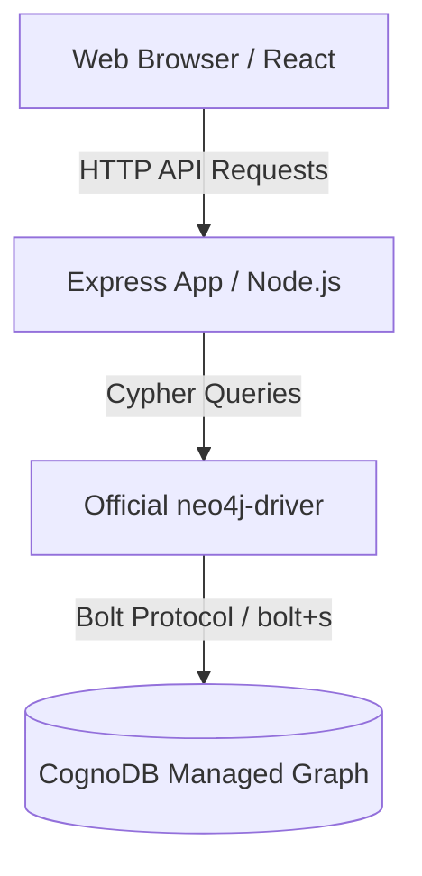
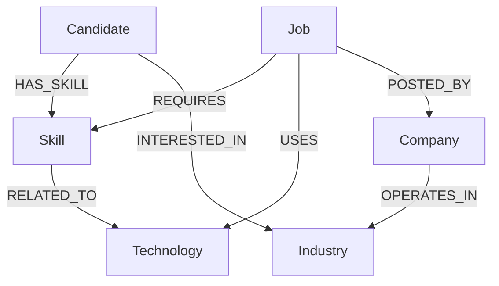

# SkillGraph

SkillGraph is a graph-powered job discovery and recommendation engine built for the Wexa AI take-home assignment. It connects candidates, skills, technologies, jobs, companies, and industries to calculate exact job matches and visualize how candidates are linked to job opportunities.

---

## Overview

Finding the right job is not just about matching text keywords. It is about understanding the contextual relationships between what a candidate knows (Skills), the tools a job requires (Skills & Technologies), who is offering the job (Companies), and the market sectors they represent (Industries). 

SkillGraph uses **CognoDB** (a managed graph database supporting openCypher over Bolt) to execute multi-hop relational traversals and expose recommendation metrics, while visualizing these pathways interactively using **React Flow**.

---

## Problem

Relational databases represent relationships using foreign keys and junction tables (e.g., `CandidateSkills`, `JobSkills`, `CompanyIndustries`). When answering multi-hop questions like:
> *"Recommend jobs to a candidate based on their skills, but also recommend jobs using technologies related to those skills, and explain the path from Candidate to Company to Industry"*

A relational database requires joining 5+ tables. As the depth of traversal increases, SQL queries become verbose, difficult to read, and slower to execute due to the combinatorial cost of nested joins.

---

## Solution

SkillGraph treats relationships as first-class entities. In a graph database, connecting a Candidate to an Industry via their Skills and Jobs is a simple pointer-chasing traversal (`MATCH path = (c)-[:HAS_SKILL]->(s)<-[:REQUIRES]-(j)-[:POSTED_BY]->(comp)`). This makes queries clean, easy to read, and highly performant for deep relationship traversals.

---

## Why a Graph Database?

A graph database is optimal for SkillGraph for three primary reasons:
1. **Multi-Hop Traversal**: Querying paths like `Candidate -> Skill -> Technology -> Job -> Company` spans 4 hops. In Cypher, this is written as a single line, whereas in SQL it requires multiple joins.
2. **Path Retrieval**: Graphs allow returning the entire traversal route (nodes and edges) as a unified path object, which can be sent directly to a visual front-end like React Flow.
3. **Flexible Schema**: Nodes and relationships can have dynamic properties, allowing easy mapping of skill categories or relationship weights without schema migrations.

---

## Key Features

* **Interactive Dashboard**: Dynamically displays graph-derived metrics (Skills count, Matched Jobs, Related Technologies, Hiring Companies) for the active candidate profile.
* **Smart Recommendations**: Combines direct skill-matching recommendations with indirect discovery (finding jobs using technologies related to the candidate's skills).
* **Job Explorer**: Search and filter jobs by location, technology, and industry, with client-side match scores calculated dynamically.
* **Job Match Analysis**: Toggles a checklist comparing candidate skills with job requirements, and renders a React Flow canvas showing the exact link chain from the Candidate to the Job's Industry.
* **Ecosystem Graph Explorer**: A full-screen interactive canvas visualizing the candidate's entire career graph, complete with zoom, pan, minimap, and a detail panel for inspecting node properties on click.
* **Global Candidate Selector**: Switch between 10 seeded candidate profiles directly in the navigation bar to see how recommendations and graphs react.

---

## Architecture & Design

SkillGraph follows a modern 3-tier architecture:



### Backend Design (Node.js / Express)
The backend is structured to separate routing, business logic, and database interactions cleanly.

* **Database Layer (`src/db/neo4j.ts`)**: Initializes the official `neo4j-driver`. A crucial design choice here is the `convertNeo4jTypes` helper function. Neo4j returns custom objects for Nodes, Relationships, and Integers. This helper recursively flattens them into standard JavaScript JSON objects so the frontend doesn't need to understand Neo4j's internal data structures.
* **Queries (`src/queries/`)**: Cypher queries are extracted into separate files (e.g., `jobs.cypher.ts`) as constants. This keeps the codebase clean and ensures that **all queries are fully parameterized**, protecting against Cypher injection.
* **Middleware (`src/middleware/errorHandler.ts`)**: A global error handler intercepts all exceptions. If it detects a Neo4j driver connection error, it gracefully swallows the stack trace and returns an HTTP `503 Service Unavailable`, fulfilling the requirement to never leak connection details.

### Frontend Design (React / Vite)
The frontend is designed to be highly interactive, relying on client-side routing and global state to explore the graph dynamically.

* **Global State (`useActiveCandidate`)**: The app uses React Context (`ActiveCandidateProvider`) to store the currently selected "Active Candidate". This allows a user to switch candidates from the navigation bar, and every component across the app instantly refetches its graph data based on that single source of truth.
* **Visualization (React Flow)**: The frontend uses the `reactflow` library to render interactive nodes and edges. Because the backend extracts full paths from the graph DB, the frontend simply maps those path segments directly into visual nodes and connecting lines.

### Core Logic / Query Design
The application leverages the graph structure to perform complex traversals:
1. **Direct Matching**: Finds jobs requiring skills that the candidate has (calculated as a match score).
2. **Indirect Discovery**: Finds jobs requiring technologies related to the skills a candidate has, even if there's no exact skill match. This multi-hop traversal (`Candidate -> Skill -> Technology -> Job`) executes in constant time on a graph database, whereas it would require a highly inefficient, nested `JOIN` query in SQL.

---

## Graph Data Model

The database schema is modeled with the following nodes and relationships:



### Node Properties

* **Candidate**: `id`, `name`, `location`, `experience`
* **Skill**: `id`, `name`, `category`
* **Job**: `id`, `title`, `location`, `experienceLevel`, `description`
* **Company**: `id`, `name`, `location`
* **Technology**: `id`, `name`, `category`
* **Industry**: `id`, `name`

---

## Example Graph

Below is a conceptual example of a traversal path mapping:

```text
                  [TypeScript] (Technology)
                       ▲
                       │ RELATED_TO
                       │
  [Sarah Jenkins] ──[:HAS_SKILL]──► [React] (Skill)
   (Candidate)                       ▲
        │                            │ REQUIRES
        │ INTERESTED_IN              │
        ▼                       [Frontend Dev] (Job)
   [SaaS] (Industry)                 │
        ▲                            │ POSTED_BY
        │ OPERATES_IN                ▼
   [TechNova] ───────────────────────┘
    (Company)
```

---

## Cypher Queries

All database queries are fully parameterized to protect against Cypher injection.

### 1. Direct Job Recommendations (Skill Matching)
Retrieves jobs that share required skills with the candidate, calculating a match percentage based on the number of overlapping skills vs. the job's total requirements:

```cypher
MATCH (c:Candidate {id: $candidateId})-[:HAS_SKILL]->(s:Skill)<-[:REQUIRES]-(j:Job)
WITH j, COUNT(DISTINCT s) AS matchedSkills
MATCH (j)-[:REQUIRES]->(required:Skill)
WITH j, matchedSkills, COUNT(DISTINCT required) AS totalSkills
OPTIONAL MATCH (j)-[:POSTED_BY]->(comp:Company)
RETURN 
  j, 
  comp,
  matchedSkills, 
  totalSkills, 
  ROUND(100.0 * matchedSkills / totalSkills) AS matchScore
ORDER BY matchScore DESC
LIMIT 10
```

### 2. Relationship-Heavy Query (Indirect Recommendations)
Traverses related nodes to suggest jobs using technologies related to skills the candidate possesses. This discovers opportunities that traditional keyword searches would miss:

```cypher
MATCH (c:Candidate {id: $candidateId})-[:HAS_SKILL]->(candidateSkill:Skill)-[:RELATED_TO]->(technology:Technology)<-[:USES]-(j:Job)
WHERE NOT (j)-[:REQUIRES]->(candidateSkill)
OPTIONAL MATCH (j)-[:POSTED_BY]->(company:Company)
RETURN DISTINCT
  j,
  company,
  collect(DISTINCT candidateSkill) AS relatedSkills,
  collect(DISTINCT technology) AS relatedTechnologies
ORDER BY company.name
LIMIT 10
```

### 3. Multi-Hop Traversal (Graph Path Query)
Extracts the full path connecting a Candidate to jobs through skills and companies to populate the React Flow canvas:

```cypher
MATCH path = (c:Candidate {id: $candidateId})-[:HAS_SKILL]->(s:Skill)<-[:REQUIRES]-(j:Job)-[:POSTED_BY]->(company:Company)
RETURN path
LIMIT 40
```

---

## Why Graph vs Relational Database

| Aspect | Relational Database (SQL) | Graph Database (CognoDB/Cypher) |
| :--- | :--- | :--- |
| **Schema** | Rigid tables, foreign keys, columns. | Highly flexible nodes and relationships. |
| **Multi-hop Queries** | Verbose, nested inner/outer `JOIN` statements. | Simple path patterns `()-[]->()`. |
| **Performance** | Degradation as depth of join traversals increase. | Constant-time traversals regardless of total dataset size. |
| **Visual Mapping** | Requires manual mapping of records to tree/network data. | Standard path outputs map directly to front-end nodes & edges. |

---

## Tech Stack

* **Frontend**: React (v19), TypeScript, Vite, Tailwind CSS, React Flow (v11), Lucide Icons
* **Backend**: Node.js, Express, TypeScript, Official `neo4j-driver` (v5)
* **Database**: CognoDB (openCypher over Bolt)
* **Testing**: Jest, Supertest, TS-Jest (unit & API tests)

---

## Project Structure

```text
skillgraph/
├── backend/
│   ├── src/
│   │   ├── config/
│   │   ├── controllers/      # Handles API requests and inputs
│   │   ├── db/               # Neo4j driver initialization & helpers
│   │   ├── middleware/       # Global error handler (shields secrets)
│   │   ├── queries/          # Standalone parameterized Cypher files
│   │   ├── routes/           # Express endpoint router mappings
│   │   ├── services/         # Business logic and graph parsers
│   │   ├── __tests__/        # Jest API and unit tests
│   │   └── server.ts         # Express bootstrapper
│   ├── scripts/
│   │   └── seed.ts           # Idempotent database seeder (using MERGE)
│   ├── .env.example
│   ├── .env                      # Git-ignored credentials file
│   ├── jest.config.js
│   ├── package.json
│   └── tsconfig.json
│
├── frontend/
│   ├── src/
│   │   ├── assets/
│   │   ├── components/
│   │   │   └── layout/       # Navbar and page wrapping
│   │   ├── hooks/            # Global ActiveCandidate provider
│   │   ├── pages/            # Dashboard, Explorer, Match, Graph Explorer
│   │   ├── services/         # API Client for express endpoints
│   │   ├── types/            # TypeScript interfaces
│   │   ├── App.tsx
│   │   ├── index.css         # Tailwind directives and custom theme
│   │   └── main.tsx
│   ├── tailwind.config.js
│   ├── postcss.config.js
│   ├── package.json
│   └── tsconfig.json
│
├── .gitignore
└── README.md
```

---

## Environment Variables

Create a `.env` file in the `backend` directory (a template is available in `backend/.env.example`):

```env
PORT=5000
COGNODB_URI=bolt+s://your-cognoDB-host:7687
COGNODB_USERNAME=cognodb
COGNODB_PASSWORD=your-cognoDB-password
```

---

## CognoDB Setup

1. Acquire connection details from your **CognoDB console** (URI, username, password).
2. Write them to the `.env` file in the `backend` directory.
3. Verify that your CognoDB instances permit secure SSL/TLS connection paths (`bolt+s://` protocol).

---

## Local Development

Follow these steps to run the application components locally.

### 1. Install Dependencies
Install dependencies separately in both the backend and frontend directories:
```bash
# Install backend dependencies
cd backend
npm install

# Install frontend dependencies
cd ../frontend
npm install
```

### 2. Seed the Database
Populate your CognoDB instance with mock candidates, skills, jobs, and relationship paths:
```bash
cd ../backend
npm run seed
```
*Note: Seeding is idempotent and uses Cypher `MERGE`. Running it multiple times will not duplicate nodes.*

### 3. Run Development Servers
Start both the backend API server and the React dev server. You will need to open two terminal windows:
```bash
# Terminal 1 (Backend API)
cd backend
npm run dev

# Terminal 2 (React Frontend)
cd frontend
npm run dev
```

---

## API Endpoints

### Health check
* `GET /api/health` - Ping database status and server timestamp.

### Candidates
* `GET /api/candidates` - Retrieves all 10 candidates.
* `GET /api/candidates/:id` - Fetch details for a specific candidate.
* `GET /api/candidates/:id/skills` - Fetch all skills possessed by a candidate.
* `GET /api/candidates/:id/recommendations` - Returns both direct (skill match) and indirect (technology match) recommendations.

### Jobs
* `GET /api/jobs` - Fetch all jobs. Supports query filters: `?search=react&location=remote&technology=TypeScript&industry=SaaS`.
* `GET /api/jobs/:id` - Fetch job details, required skills, and technologies.

### Graph Data
* `GET /api/graph/candidate/:id` - Fetch candidate ego-graph data formatted as `{ nodes: [], edges: [] }`.
* `GET /api/graph/job/:id?candidateId=...` - Fetch specific match path connecting candidate to job.

---

## Trade-offs

* **React Flow Coordinates**: To avoid bringing in complex client-side graph layout engines (like Dagre), we implement a dynamic coordinate distribution system based on node label stages (Candidate -> Skill -> Job -> Company). While this creates a clean horizontal layout, nodes inside columns are spaced evenly. For massive subgraphs with 50+ matches, a force-directed layout engine (like D3-force) would scale better.
* **Read-Heavy Query Aggregation**: The recommendations endpoint runs both direct and indirect queries in parallel using `Promise.all`. While highly efficient for our mock data, under production loads with thousands of candidates, recommendations should be cached or pre-computed.

---

## Future Improvements

* **D3 Force Layouts**: Incorporate d3-force to lay out nodes organically in the Graph Explorer canvas.
* **Dynamic Profile Builder**: Allow users to add new candidates and skills directly in the frontend, modifying the graph structure in real time.
* **Weighted Job Matches**: Incorporate skill weights (e.g., *Required* vs. *Preferred*) in Cypher queries to compute more accurate matching scores.
